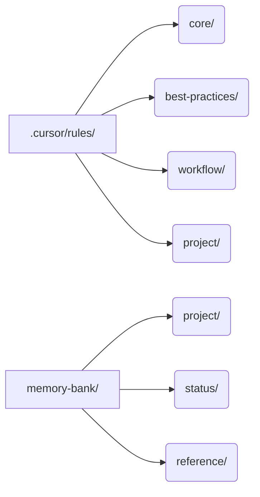
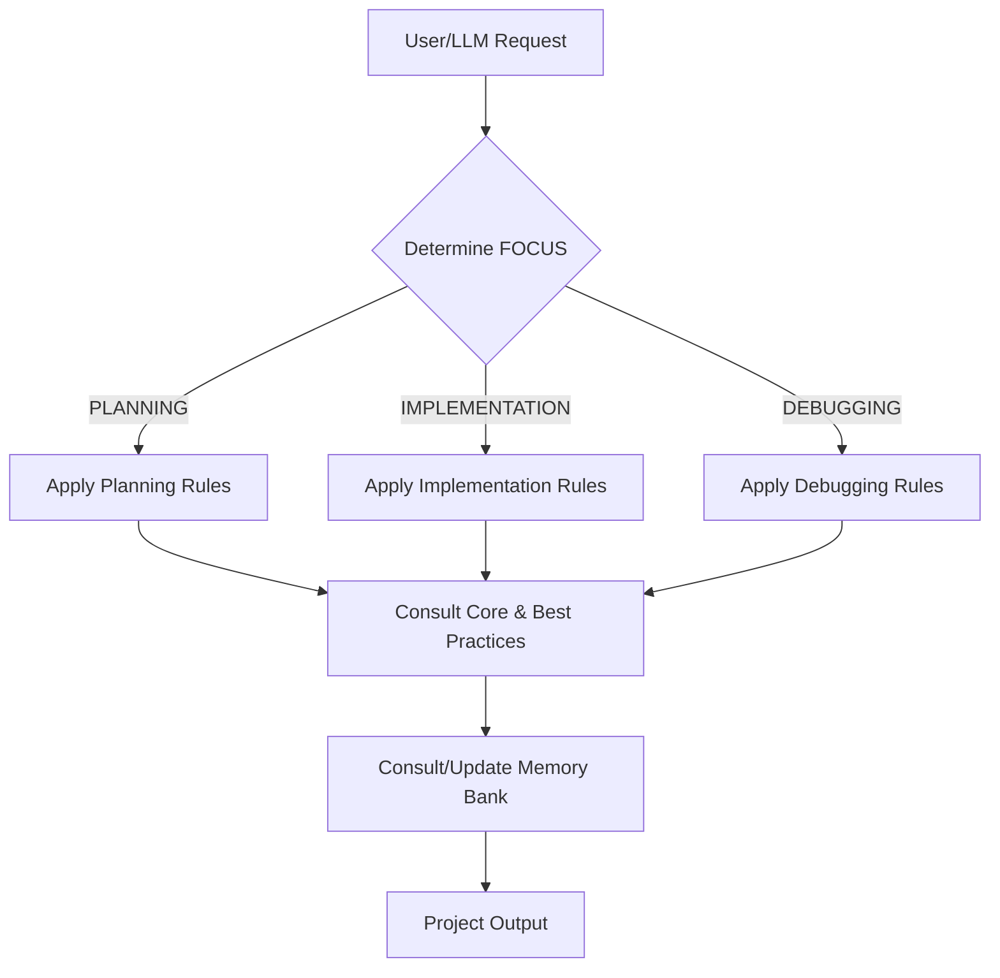

# Project Template: LLM-Driven Development & Documentation

Welcome! This template provides a robust framework for managing, documenting, and automating your project's development process using LLM-assisted rules and a structured memory bank.

---

## 🚀 What Does This Template Do?

- **Automates project context, workflow, and documentation for LLMs and humans**
- **Enforces best practices, coding standards, and workflow discipline**
- **Tracks project status, tasks, and lessons learned**
- **Provides a living, queryable knowledge base for your project**

---

## 📁 Project Layout

After installing withing your project will have:

- `.cursor/rules/`: All rule files (core, best-practices, workflow, project-specific)
- `memory-bank/`: Project context, status, architecture, and reference docs

---

## 🗂️ Rules Overview

- **Core Rules**: Always active. Define LLM behavior, memory bank usage, and coding standards.
- **Best Practices**: Lessons learned, error documentation, and continuous improvement.
- **Workflow Rules**: Activated by FOCUS (PLANNING, IMPLEMENTATION, DEBUGGING). Guide the LLM and team through each phase.
- **Project Rules**: Any project-specific or custom rules.

---

## 🧠 Memory Bank: What to Update First

Update these files to reflect your project:

- [ ] `memory-bank/project/project_brief.md` — Project overview, objectives, users, timeline, metrics
- [ ] `memory-bank/project/product_context.md` — Problem, solution, value, market, competitive advantage
- [ ] `memory-bank/project/architecture.md` — System architecture (add if missing)
- [ ] `memory-bank/project/system_patterns.md` — Design patterns, data flow, security (add if missing)
- [ ] `memory-bank/project/tech_context.md` — Tech stack, integrations, deployment (add if missing)
- [ ] `memory-bank/project/directory_structure.md` — Source code layout
- [ ] `memory-bank/status/project_status.md` — Current progress, tasks, milestones, blockers
- [ ] `memory-bank/reference/troubleshooting_log.md` — Error log (add if missing)
- [ ] `memory-bank/reference/user_docs/` — End-user guides (optional)
- [ ] `memory-bank/reference/release_docs/` — Release notes (optional)

---

## 🔄 How FOCUS Works

The LLM and workflow rules use a concept called **FOCUS** to determine which rules to apply:

- **PLANNING**: Requirements, architecture, and solution design
- **IMPLEMENTATION**: Writing code, applying standards, testing
- **DEBUGGING**: Diagnosing and fixing issues, updating documentation

**How to Use:**

- Explicitly set FOCUS in your requests (e.g., "FOCUS = PLANNING") or let the LLM infer from context
- The LLM will apply the correct workflow rules and prompt you if FOCUS is ambiguous

---

## 📚 Lessons Learned & Error Documentation

- **Lessons Learned**: Add key insights and patterns to `memory-bank/best-practices/lessons-learned.md` (or as referenced in rules)
- **Error Documentation**: Log significant/recurring errors in `memory-bank/reference/troubleshooting_log.md` using the format in `rules/best-practices/error_documentation_guidelines.md`
- The LLM will prompt you to update these after major issues or discoveries

---

## 📖 Reference Docs & `llms.txt`

- For each major library in your tech stack (`memory-bank/project/tech_context.md`), the LLM will:
  - Look for a local roadmap: `memory-bank/reference/api_docs/[LIBRARY]/[MAJOR_VERSION]/llms.txt`
  - If missing, prompt you to provide a documentation URL
  - Summarize and create `llms.txt` and additional summaries as needed
- This enables the LLM to answer questions and generate code using project-approved docs

---

## 📝 How the Rules Work Together

- **User/LLM Request**: Triggers the workflow
- **Determine FOCUS**: Sets the phase (PLANNING, IMPLEMENTATION, DEBUGGING)
- **Apply Workflow Rules**: Guides actions for the phase
- **Consult Core/Best Practices**: Ensures standards and lessons are followed
- **Consult/Update Memory Bank**: Keeps project context and docs up to date

---

## 🛠️ Additional Tips

- Keep your memory bank up to date—it's the LLM's source of truth
- Use the checklists above when starting a new project
- Review and adapt rules as your project evolves
- For custom workflows, add or modify rules in `.cursor/rules/project/`

---

## Need Help?

- See the `README.md` in each rules subdirectory for more details
- Consult the LLM with questions about rule usage or project setup
