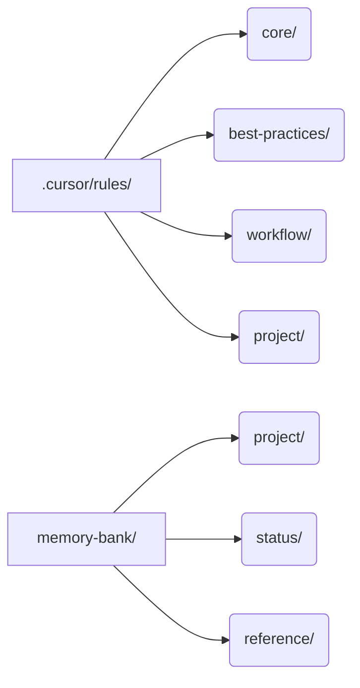
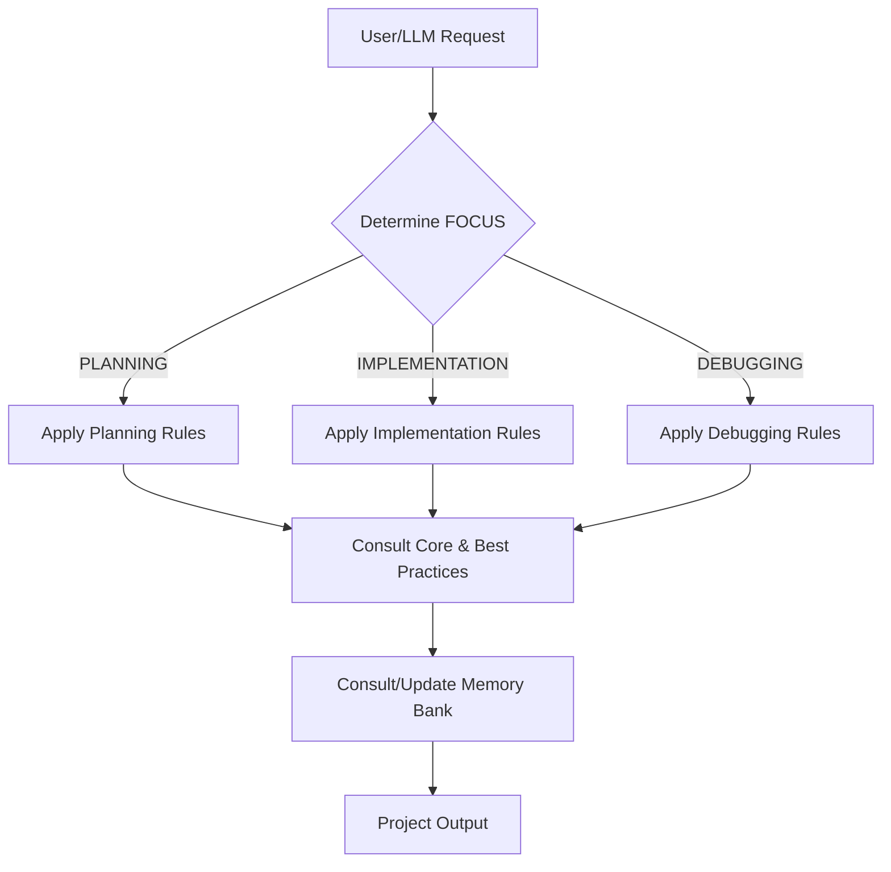

# Project Template: LLM-Driven Development & Documentation

Welcome! This template provides a robust framework for managing, documenting, and automating your project's development process using LLM-assisted rules and a structured memory bank.

---

## 🚀 What Does This Template Do?

- **Automates project context, workflow, and documentation for LLMs and humans**
- **Enforces best practices, coding standards, and workflow discipline**
- **Tracks project status, tasks, and lessons learned**
- **Provides a living, queryable knowledge base for your project**

> **NOTE**: This is Cursor specific.  Cursor rules give you the granularity control this process that other agentic editing tools do not (to my knowledge).  Submit an issue to collaborate and add support for those editors if you find this useful and you have a working solution for another editor.

---

## 🛠️ CLI Usage: main.py

You can use the provided CLI tool to manage rules and lint documentation links. Run:

```text
Usage: main.py [OPTIONS] COMMAND [ARGS]...

Options:
  --help  Show this message and exit.

Commands:
  lint              Lint all markdown links in the project and warn if links are broken
  project-to-rules  <project-dir> Compare .cursor/rules/*.mdc to rules/*.md after reversing the mdc: links
  rules-to-project  <project-dir> Copy rules to project/.cursor/rules with path/content, 
                                  renaming to .mdc and changing markdown links to mdc:
```

- **lint**: Lint all markdown links in the project and warn if any are broken or malformed.
- **project-to-rules**: Compare `.cursor/rules/*.mdc` to `rules/*.md` after project changes and sync as needed.
- **rules-to-project**: Copy rules to `project/.cursor/rules` with correct path/content for project use.

---

## 📁 Project Layout

After installing withing your project will have:



- `.cursor/rules/`: All rule files (core, best-practices, workflow, project-specific)
- `memory-bank/`: Project context, status, architecture, and reference docs

---

## 🗂️ Rules Overview

- **Core Rules**: Always active. Define LLM behavior, memory bank usage, and coding standards.
- **Best Practices**: Lessons learned, error documentation, and continuous improvement.
- **Workflow Rules**: Activated by FOCUS (PLANNING, IMPLEMENTATION, DEBUGGING). Guide the LLM and team through each phase.
- **Project Rules**: Any project-specific or custom rules.

---

## 🧠 Memory Bank: What to Update First

Update these files to reflect your project:

- [ ] `memory-bank/project/project_brief.md` — Project overview, objectives, users, timeline, metrics
- [ ] `memory-bank/project/product_context.md` — Problem, solution, value, market, competitive advantage
- [ ] `memory-bank/project/architecture.md` — System architecture (add if missing)
- [ ] `memory-bank/project/system_patterns.md` — Design patterns, data flow, security (add if missing)
- [ ] `memory-bank/project/tech_context.md` — Tech stack, integrations, deployment (add if missing)
- [ ] `memory-bank/project/directory_structure.md` — Source code layout
- [ ] `memory-bank/status/project_status.md` — Current progress, tasks, milestones, blockers
- [ ] `memory-bank/reference/troubleshooting_log.md` — Error log (add if missing)
- [ ] `memory-bank/reference/user_docs/` — End-user guides (optional)
- [ ] `memory-bank/reference/release_docs/` — Release notes (optional)

---

## 🔄 How FOCUS Works

The LLM and workflow rules use a concept called **FOCUS** to determine which rules to apply:

- **PLANNING**: Requirements, architecture, and solution design
- **IMPLEMENTATION**: Writing code, applying standards, testing
- **DEBUGGING**: Diagnosing and fixing issues, updating documentation

**How to Use:**

- Explicitly set FOCUS in your requests (e.g., "FOCUS = PLANNING") or let the LLM infer from context
- The LLM will apply the correct workflow rules and prompt you if FOCUS is ambiguous

---

## 📚 Lessons Learned & Error Documentation

- **Lessons Learned**: Add key insights and patterns to `memory-bank/best-practices/lessons-learned.md` (or as referenced in rules)
- **Error Documentation**: Log significant/recurring errors in `memory-bank/reference/troubleshooting_log.md` using the format in `rules/best-practices/error_documentation_guidelines.md`
- The LLM will prompt you to update these after major issues or discoveries

---

## 📖 Reference Docs & `llms.txt`

- For each major library in your tech stack (`memory-bank/project/tech_context.md`), the LLM will:
  - Look for a local roadmap: `memory-bank/reference/api_docs/[LIBRARY]/[MAJOR_VERSION]/llms.txt`
  - If missing, prompt you to provide a documentation URL
  - Summarize and create `llms.txt` and additional summaries as needed
- This enables the LLM to answer questions and generate code using project-approved docs

You may also precisely control this process and deliberately trigger LLM documentation generation for a specific section or the main roadmap by referencing the relevant rules in your request.

---

### 📑 How to Explicitly Generate the Main Roadmap (`llms.txt`) for a Library

To create or update the main documentation roadmap (`llms.txt`) for a library (used as the authoritative index for LLM lookups):

1. **Explicitly request the roadmap.**  
   Use phrases like:
   - "Generate the documentation roadmap for [LIBRARY] v[MAJOR_VERSION] from `@web https://.....`"
   - "Update the llms.txt for [LIBRARY] v[MAJOR_VERSION] from `@web https://.....`"
   - "Apply the rules in `@memory-bank-summarize-library.mdc` to create or update the roadmap from `@web https://.....`"

2. **What happens:**
   - The LLM will check for an existing roadmap at `memory-bank/reference/api_docs/[LIBRARY]/[MAJOR_VERSION]/llms.txt`.
   - If missing, you'll be prompted to provide the main documentation URL for the library/version.
   - The LLM will crawl the main page, extract key navigation links/sections, and propose a Markdown index (llms.txt) with links to all major sections.
   - Optionally, you can request summaries of foundational sections (see below).
   - The roadmap will be saved and used as the primary reference for all future LLM queries about that library/version.

3. **To force a refresh or update:**
   - Explicitly request: "Refresh the llms.txt for [LIBRARY] v[MAJOR_VERSION] using the latest docs and `@memory-bank-summarize-library.mdc`"

4. **Note:**
   - The roadmap is a comprehensive, link-rich index—minimal commentary, just structure and links.
   - For detailed summaries of specific sections, see the next section.

---

### 📑 How to Explicitly Generate Section-Specific Summaries (`llms-[section].txt`)

To create a detailed, LLM-optimized summary for a specific section of a library's documentation:

1. **Explicitly request a summary or technical overview for the section.**  
   Use phrases like:
   - "Summarize the [SECTION] section of [LIBRARY] v[MAJOR_VERSION] from `@web https://.....`"
   - "Generate a technical overview of the [SECTION] docs for [LIBRARY] v[MAJOR_VERSION] from `@web https://.....`"
   - "Create an LLM-friendly summary of [SECTION] for [LIBRARY] v[MAJOR_VERSION] from `@web https://.....`"
   - "Apply the rules in `@memory-bank-update-section.mdc` to generate a summary for [SECTION] from `@web https://.....`"

2. **What happens:**
   - The LLM will crawl ONLY the specified section/page.
   - A detailed, LLM-optimized summary will be written to:
     `memory-bank/reference/api_docs/[LIBRARY]/[MAJOR_VERSION]/llms-[section].txt`
   - The main `llms.txt` will be updated to link to this new file.

3. **To force a refresh or update:**
   - Explicitly request: "Refresh the summary for [SECTION] in [LIBRARY] v[MAJOR_VERSION] using `@memory-bank-update-section.mdc`"

4. **Note:**
   - The summary will be thorough, structured, and suitable for LLM/code reference.
   - No other sections will be crawled or summarized unless you request them.
   - Referencing the rule files in your request ensures the correct workflow is applied.

---

## 📝 How the Rules Work Together



- **User/LLM Request**: Triggers the workflow
- **Determine FOCUS**: Sets the phase (PLANNING, IMPLEMENTATION, DEBUGGING)
- **Apply Workflow Rules**: Guides actions for the phase
- **Consult Core/Best Practices**: Ensures standards and lessons are followed
- **Consult/Update Memory Bank**: Keeps project context and docs up to date

---

## 🛠️ Additional Tips

- Keep your memory bank up to date—it's the LLM's source of truth
- Use the checklists above when starting a new project
- Review and adapt rules as your project evolves
- For custom workflows, add or modify rules in `.cursor/rules/project/`

---

## Need Help?

- See the `README.md` in each rules subdirectory for more details
- Consult the LLM with questions about rule usage or project setup
