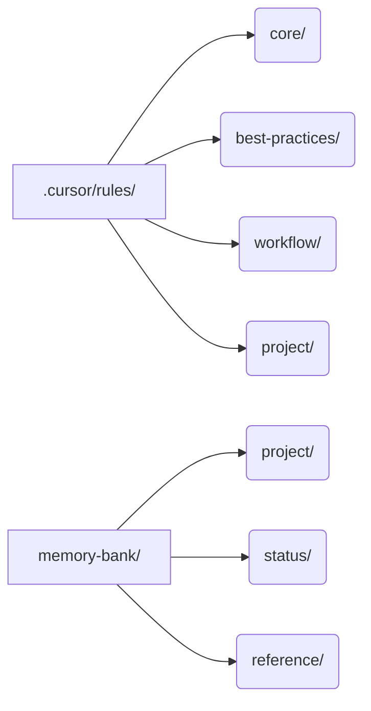
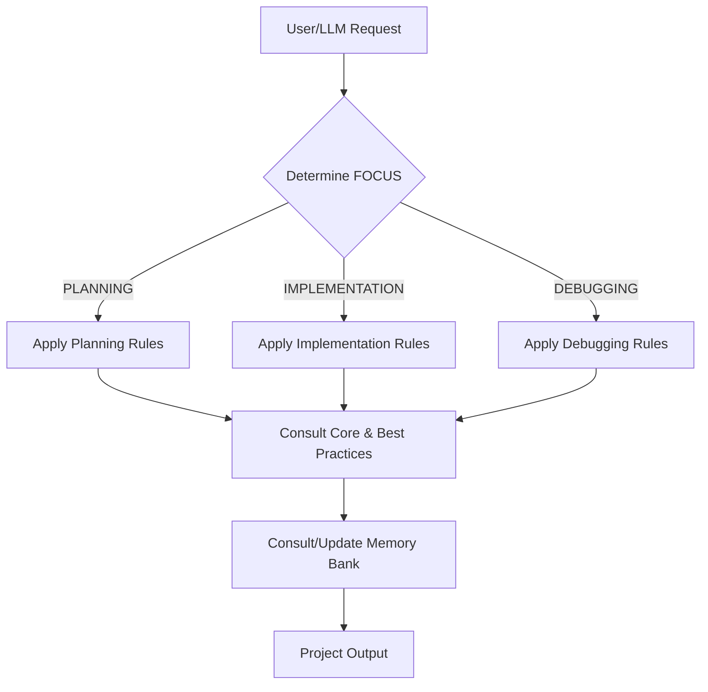

# Project Template: LLM-Driven Development & Documentation

Welcome! This template provides a robust framework for managing, documenting, and automating your project's development process using LLM-assisted rules and a structured memory bank.

---

## 🚀 What Does This Template Do?

- **Automates project context, workflow, and documentation for LLMs and humans**
- **Enforces best practices, coding standards, and workflow discipline**
- **Tracks project status, tasks, and lessons learned**
- **Provides a living, queryable knowledge base for your project**

> **NOTE**: This is Cursor specific and Windsurf specific at this current time.  Collaboration to support other platforms is welcomed.

---

## 📁 Project Layout

After installing withing your project will have:

- `.cursor/rules/`: All rule files (core, best-practices, workflow, project-specific)
- `memory-bank/`: Project context, status, architecture, and reference docs

---

## 🗂️ Rules Overview

- **Core Rules**: Always active. Define LLM behavior, memory bank usage, and coding standards.
- **Best Practices**: Lessons learned, error documentation, and continuous improvement.
- **Workflow Rules**: Activated by FOCUS (PLANNING, IMPLEMENTATION, DEBUGGING). Guide the LLM and team through each phase.
- **Project Rules**: Any project-specific or custom rules.

---

## 🔄 How FOCUS Works

The LLM and workflow rules use a concept called **FOCUS** to determine which rules to apply:

- **PLANNING**: Requirements, architecture, and solution design
- **IMPLEMENTATION**: Writing code, applying standards, testing
- **DEBUGGING**: Diagnosing and fixing issues, updating documentation

**How to Use:**

- Explicitly set FOCUS in your requests (e.g., "FOCUS = PLANNING") or let the LLM infer from context
- The LLM will apply the correct workflow rules and prompt you if FOCUS is ambiguous

### Examples of FOCUS

> Your focus is PLANNING for this task
> 
> Review @src from an online no-code builder.  This project has the look/feel I want, but is not integrated with @aws-amplify/ui-react
> 
> This must be a detailed plan with steps I can indiividually tackle
> 
> Plan out how to create those components in my project
> Plan out how to migrate the colors and assets into my project
> Write that plan into steps with each step into a new markdown file in @status and reference this within the pending/ To Do section of @project_status.md 

---

> OK, set your focus to planning the authentication so users are fully authenticated when they hit the dashboard
> 
> Please review @llms-authentication.txt and @llms-backend-authentication-index.txt for key points that need to be addressed

---

> OK, your focus is planning:  In reviewing @NewExpenseForm.tsx -- this feels very large and in need to refactoring.  How would you refactor this to be more modular and maintainable

---

## 📚 Lessons Learned & Error Documentation

- **Lessons Learned**: Add key insights and patterns to `memory-bank/best-practices/lessons-learned.md` (or as referenced in rules)
- **Error Documentation**: Log significant/recurring errors in `memory-bank/reference/troubleshooting_log.md` using the format in `rules/best-practices/error_documentation_guidelines.md`
- The LLM will prompt you to update these after major issues or discoveries

---

## 📖 Reference Docs & `llms.md`

- For each major library in your tech stack (`memory-bank/project/tech_context.md`), the LLM will:
  - Look for a local roadmap: `memory-bank/reference/api_docs/[LIBRARY]/[MAJOR_VERSION]/llms.md`
  - If missing, prompt you to provide a documentation URL
  - Summarize and create `llms.md` and additional summaries as needed
- This enables the LLM to answer questions and generate code using project-approved docs

You may also precisely control this process and deliberately trigger LLM documentation generation for a specific section or the main roadmap by referencing the relevant rules in your request.

---

### 📑 How to Explicitly Generate the Main Roadmap (`llms.md`) for a Library

To create or update the main documentation roadmap (`llms.md`) for a library (used as the authoritative index for LLM lookups):

1. **Explicitly request the roadmap.**  
   Use phrases like:
   - "Generate the documentation roadmap for [LIBRARY] v[MAJOR_VERSION] from `@web https://.....`"
   - "Update the llms.md for [LIBRARY] v[MAJOR_VERSION] from `@web https://.....`"
   - "Apply the rules in `@memory-bank-summarize-library.mdc` to create or update the roadmap from `@web https://.....`"

2. **What happens:**
   - The LLM will check for an existing roadmap at `memory-bank/reference/api_docs/[LIBRARY]/[MAJOR_VERSION]/llms.md`.
   - If missing, you'll be prompted to provide the main documentation URL for the library/version.
   - The LLM will crawl the main page, extract key navigation links/sections, and propose a Markdown index (llms.md) with links to all major sections.
   - Optionally, you can request summaries of foundational sections (see below).
   - The roadmap will be saved and used as the primary reference for all future LLM queries about that library/version.

3. **To force a refresh or update:**
   - Explicitly request: "Refresh the llms.md for [LIBRARY] v[MAJOR_VERSION] using the latest docs and `@memory-bank-summarize-library.mdc`"

4. **Note:**
   - The roadmap is a comprehensive, link-rich index—minimal commentary, just structure and links.
   - For detailed summaries of specific sections, see the next section.

#### Examples for the Main Roadmap

> Update your memory bank using @memory-bank-library-overview.mdc for @https://lucide.dev/guide/packages/lucide-react version 0

---

> Using @memory-bank-library-overview.mdc and @https://ai-sdk.dev/docs/introduction create the summary for ai@4 

---

### 📑 How to Explicitly Generate Section-Specific Summaries (`llms-[section].txt`)

To create a detailed, LLM-optimized summary for a specific section of a library's documentation:

1. **Explicitly request a summary or technical overview for the section.**  
   Use phrases like:
   - "Summarize the [SECTION] section of [LIBRARY] v[MAJOR_VERSION] from `@web https://.....`"
   - "Generate a technical overview of the [SECTION] docs for [LIBRARY] v[MAJOR_VERSION] from `@web https://.....`"
   - "Create an LLM-friendly summary of [SECTION] for [LIBRARY] v[MAJOR_VERSION] from `@web https://.....`"
   - "Apply the rules in `@memory-bank-update-section.mdc` to generate a summary for [SECTION] from `@web https://.....`"

2. **What happens:**
   - The LLM will crawl ONLY the specified section/page.
   - A detailed, LLM-optimized summary will be written to:
     `memory-bank/reference/api_docs/[LIBRARY]/[MAJOR_VERSION]/llms-[section].txt`
   - The main `llms.md` will be updated to link to this new file.

3. **To force a refresh or update:**
   - Explicitly request: "Refresh the summary for [SECTION] in [LIBRARY] v[MAJOR_VERSION] using `@memory-bank-update-section.mdc`"

4. **Note:**
   - The summary will be thorough, structured, and suitable for LLM/code reference.
   - No other sections will be crawled or summarized unless you request them.
   - Referencing the rule files in your request ensures the correct workflow is applied.

#### Examples for the Section Specific Summary

> update your memory-bank using @memory-bank-section-summarize.mdc for cli-commands @https://docs.amplify.aws/react/reference/cli-commands/ 

---

> Using @memory-bank-section-summarize.mdc update the function section of amplify v6 from @https://docs.amplify.aws/vue/build-a-backend/functions/set-up-function/ 

---

## 📝 How the Rules Work Together

- **User/LLM Request**: Triggers the workflow
- **Determine FOCUS**: Sets the phase (PLANNING, IMPLEMENTATION, DEBUGGING)
- **Apply Workflow Rules**: Guides actions for the phase
- **Consult Core/Best Practices**: Ensures standards and lessons are followed
- **Consult/Update Memory Bank**: Keeps project context and docs up to date

---

## 🛠️ Additional Tips

- Keep your memory bank up to date—it's the LLM's source of truth
- Use the checklists above when starting a new project
- Review and adapt rules as your project evolves
- For custom workflows, add or modify rules in `.cursor/rules/project/`

---

## Need Help?

- See the `README.md` in each rules subdirectory for more details
- Consult the LLM with questions about rule usage or project setup
